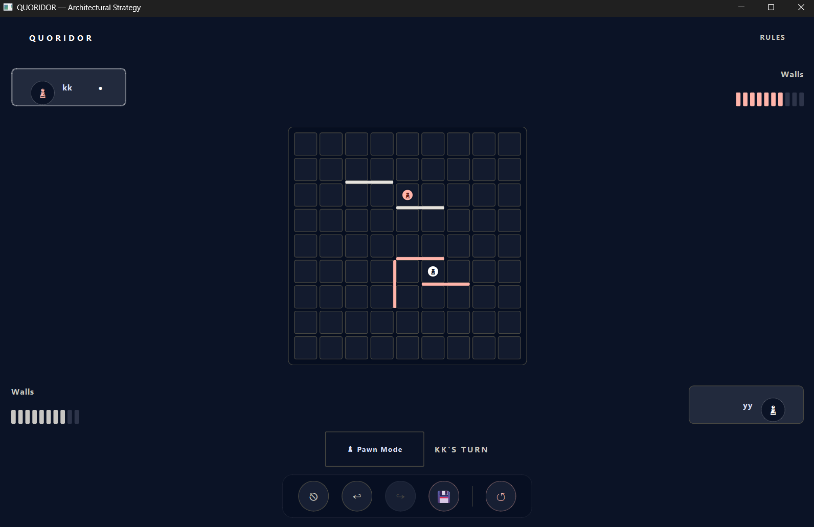

# QUORIDOR — Architectural Strategy Board Game

**CSE472s: Artificial Intelligence curse project**  
An interactive, dark-themed, and highly optimized desktop implementation of the abstract strategy board game **Quoridor**. Built with **Python** and **PySide6** (Qt for Python), this project combines architectural aesthetics, smooth animations, and advanced AI opponents.

---

## Key Features

### Core Mechanics
*   **Full Quoridor Ruleset**: Complete implementation of two-player movements, orthogonal steps, jumping over opponents, and diagonal sidestepping when jumps are blocked.
*   **Safe Wall Placements**: Real-time BFS-based pathfinding checks ensure no wall placement can completely block either player's path to their goal row.
*   **Custom Board Canvas**: A fully responsive, custom-painted grid (`QPainter`) with real-time hover previews, active move highlights, and smooth pawn movement animations.

### AI Engine
*   **Novice (Easy)**: A friendly opponent that navigates towards its goal line, occasionally placing a random wall.
*   **Adept (Medium)**: A smart, greedy agent that uses 1-ply search with oscillation penalties to prevent repetitive loops.
*   **Architect (Hard)**: A highly strategic opponent powered by **Minimax with Alpha-Beta Pruning**, dynamic search depths (up to 6 plies), and smart move ordering. It runs asynchronously on a background thread pool (`QThreadPool`) to keep the UI smooth and responsive.

### Extra Features
*   **Undo/Redo Actions**: A robust implementation of the Command Pattern that tracks turn histories, letting players undo and redo both pawn moves and wall placements.
*   **Save/Load Support**: Allows players to serialize and resume match states using a structured JSON pipeline.
*   **Rules Guide**: An interactive, responsive guide screen that explains the game objectives and mechanics.

## Screenshots of Game in action

* **Main Menu Screen** 

---
* **Match Setup Screens** 


---
* **Board Gameplay Screen**

---
* **Victory Screen**

---
* **Save/Load feature**


---

## Installation & Setup

### Prerequisites
*   Python **$\ge$ 3.10**
*   pip (Python package manager)

### Quick Start Guide

1. **Clone the Repository**
   ```bash
   git clone "https://github.com/cs2mosa/QUORIDOR_GAME.git"
   cd Quridor-Game
   ```

2. **Create and Activate a Virtual Environment**
   ```bash
   # On macOS/Linux
   python3 -m venv .venv
   source .venv/bin/activate

   # On Windows
   python -m venv .venv
   .venv\Scripts\activate
   ```

3. **Install Dependencies**
   ```bash
   pip install --upgrade pip
   pip install requirements.txt
   ```

4. **Run the Game**
   ```bash
   python src\main.py
   ```

---

## Controls & Keyboard Shortcuts

The interface supports intuitive mouse controls along with the following keyboard shortcuts for quick navigation:

| Key Command | Action | Description |
| :--- | :--- | :--- |
| **`Escape`** | Exit Game | Aborts the active match and returns to the Main Menu |
| **`Ctrl + Z`** | Undo | Rolls back the last completed turn |
| **`Ctrl + Y`** | Redo | Re-applies the last undone turn |
| **`Ctrl + S`** | Save Match | Opens a file dialog to save the current game state to a JSON file |
| **`Ctrl + R`** | Reset Match | Fully resets the active board state while keeping player names |

---

## System Architecture

The source code is structured with a clean separation of concerns:

```
src
├── main.py                           # App entry point & initialization
├── controllers/
│   ├── game_controller.py            # Core game logic & AI thread management
│   └── navigation_controller.py      # UI screen routing
├── models/
│   ├── board.py                      # Grid state, overlaps, and movement rules
│   ├── game_state.py                 # Match state, player inventories, and Undo/Redo
│   ├── pathfinder.py                 # BFS search engine and cache optimizations
│   ├── pawn.py                       # Pawn coordinates & goals
│   └── wall.py                       # Wall placements
├── services/
│   └── ai_engine.py                  # Novice, Adept, and Architect decision paths
└── views/
    ├── styles.py                     # Theme colors and style declarations
    ├── components/
    │   ├── board_widget.py           # Custom board painting & hit detection
    │   ├── top_bar.py                # App top bar
    │   └── wall_indicator.py         # Inventory bars
    └── screens/
        ├── main_menu_screen.py       # Landing screen
        ├── local_match_screen.py     # Local game configuration
        ├── ai_match_screen.py        # AI game configuration
        ├── board_screen.py           # Interactive match arena
        ├── victory_screen.py         # Match results
        └── rules_screen.py           # Game rules screens
```

---

## Verification & Testing

The project includes an integration test suite that runs in a headless environment. The tests verify rule compliance, path safety, and AI decision-making.

Run the test suite using:
```bash
python -m unittest tests/test_integration.py
```

---

## Demonstration Video

Watch our [3-5 Minute Quoridor Demonstration Video](https://drive.google.com/file/d/1EtZwzi6KtsVKubiIZ74-1KFPgtUmQCk_/view?usp=drive_link) to see a complete overview of the gameplay modes, single-player AI tiers, and extra features.