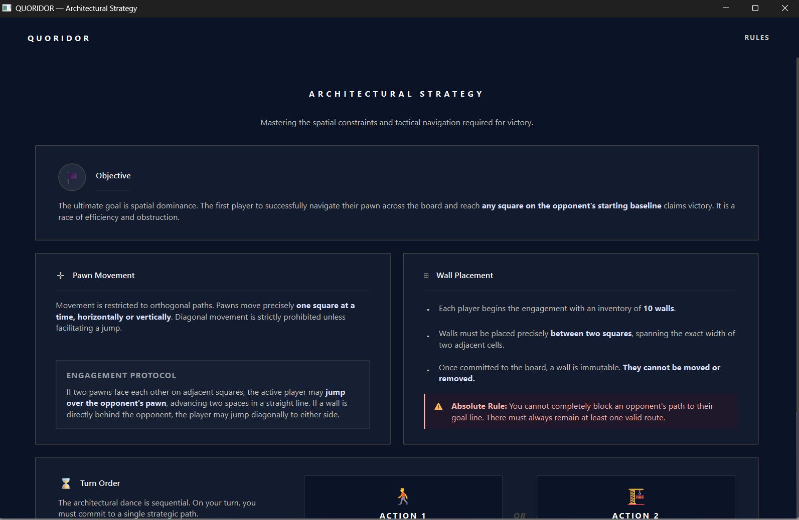

# QUORIDOR — Architectural Strategy

> **CSE472s: Artificial Intelligence — Spring 2026 Term Project**  
> A complete desktop implementation of the abstract strategy board game Quoridor, built with Python 3.11+ and PySide6 (Qt 6).

---

## Table of Contents

1. [Game Overview](#game-overview)
2. [Core Architecture & Design](#core-architecture--design)
3. [Project Structure](#project-structure)
4. [Installation & Running](#installation--running)
5. [Controls & Gameplay](#controls--gameplay)
6. [AI Difficulty Tiers](#ai-difficulty-tiers)
7. [Bonus Features](#bonus-features)
8. [Screenshots](#screenshots)
9. [Demo Video](#demo-video)
10. [Team Members](#team-members)
11. [References](#references)

---

## Game Overview

**Quoridor** is a strategy board game invented by Mirko Marchesi, first released in 1997. The game is played on a 9×9 grid where each player controls a single pawn and is given 10 walls. The objective is to be the first player to move your pawn to any square on the opposite side of the board.

On each turn, a player must choose **exactly one** action:
- **Move their pawn** one square orthogonally (forward, backward, left, or right)
- **Place a wall** spanning two adjacent squares to block the opponent's path

Walls cannot overlap, cross each other, or completely block a player's path to their goal — there must always remain at least one valid route for each player.

### Special Movement Rules
- **Jump over opponent**: If your pawn is adjacent to the opponent's pawn, you may jump over them (moving two squares in a straight line) if not blocked by a wall.
- **Diagonal sidestep**: If a straight jump is blocked by a wall or the board edge, you may move diagonally to either side of the opponent's pawn.

---

## Core Architecture & Design

This project follows a strict **Model-View-Controller (MVC)** architectural pattern with additional service-layer separation for the AI engine. The design prioritizes **separation of concerns**, **testability**, and **extensibility**.

```
┌─────────────────────────────────────────────────────────────┐
│                        QUORIDOR APP                         │
│─────────────────────────────────────────────────────────────│
│                                                             │
│  ┌─────────────┐    signals/slots     ┌───────────────┐     │
│  │    VIEW     │  ←────────────────   │   CONTROLLER  │     │
│  │  (PySide6)  │  ────────────────►   │   (Qt layer)  │     │
│  └─────────────┘        events        └───────────────┘     │
│                                               │             │
│                                       mutates / reads       │
│                                               ▼             │
│                                      ┌─────────────────┐    │
│                                      │      MODEL      │    │
│                                      │  (Pure Python)  │    │
│                                      └─────────────────┘    │
│                                               │             │
│                                         uses for AI         │
│                                               ▼             │
│                                      ┌─────────────────┐    │
│                                      │   AI SERVICE    │    │
│                                      │  (QRunnable)    │    │
│                                      └─────────────────┘    │
└─────────────────────────────────────────────────────────────┘
```

### Model Layer (`models/`)
The Model layer contains **all game logic** with **zero Qt dependencies**, making it fully unit-testable in isolation.

| Component | Responsibility |
|-----------|---------------|
| `Wall` / `WallOrientation` | Immutable dataclass representing a placed wall segment |
| `Pawn` | Mutable value object tracking position, goal row, and movement |
| `Board` | Owns wall sets, validates placements, computes passage between cells, generates legal moves |
| `Pathfinder` | Stateless BFS utility for path-existence and shortest-path queries |
| `GameState` | **Aggregate root** — owns Board, Pawns, PlayerInfo, turn tracking, and Command-pattern history stacks |
| `PlayerInfo` | Display metadata (name, AI flag, wall counts, turn counts) |

**Key Design Decisions:**
- **Immutable Wall records** (`frozen=True` dataclass) prevent accidental mutation and enable O(1) set-based storage.
- **Board does not own Pawns** — positions are passed into validation calls, allowing the AI to clone only the Board for lookahead.
- **Pathfinder is stateless** — all methods are `@staticmethod`, eliminating lifecycle management overhead.
- **GameState is the sole mutation point** — the Controller never calls Board or Pawn methods directly.

### View Layer (`views/`)
The View layer is purely **declarative**: it renders state it has been given and emits Signals when the user interacts. It contains **no business logic**.

| Component | Responsibility |
|-----------|---------------|
| `styles.py` | Central colour token registry, master QSS stylesheet, and typography helpers |
| `BoardWidget` | Custom-painted 9×9 board with responsive scaling, animated pawns, wall previews, and hit-testing |
| `WallIndicator` | Custom-painted bar showing remaining walls (10 bars, filled = remaining) |
| `TopBar` | Reusable navigation bar with RULES link (appears on all 6 screens) |
| `MainMenuScreen` | Landing page with Local Multiplayer, Play vs AI, and Load Game options |
| `LocalMatchScreen` | Two-player name input with VS divider |
| `AiMatchScreen` | Player name input + three difficulty card selectors (Novice / Adept / Architect) |
| `BoardScreen` | Gameplay wrapper: opponent HUD, board widget, active player HUD, mode toggle, toolbar |
| `VictoryScreen` | Post-game stats: winner name, turns taken, walls placed |
| `RulesScreen` | Scrollable bento-grid rules reference with Objective, Movement, Wall Placement, and Turn Order |

**Design Rules:**
- Single `refresh()` method per screen pushes all state in one atomic call.
- All colours imported from `styles.COLORS` — never hardcoded.
- Custom painting (`QPainter`) for BoardWidget and WallIndicator; QSS for all other widgets.

### Controller Layer (`controllers/`)
| Component | Responsibility |
|-----------|---------------|
| `GameController` | Owns `GameState`. Processes all user input events. Drives AI via `AIWorker`. Emits lifecycle signals (`game_started`, `game_over`, `board_updated`). |
| `NavigationController` | Owns `QStackedWidget` and all 6 screen instances. Wires every inter-screen signal. Manages the Rules back-stack. |

**Why two controllers?** Separating navigation from game logic allows either to be replaced independently. The `GameController` knows nothing about which screen is visible; the `NavigationController` knows nothing about the game score.

### Service Layer (`services/`)
| Component | Responsibility |
|-----------|---------------|
| `ai_engine.py` | Stateless AI plugin. Exposes `compute_move(state, ai_idx, difficulty) → dict`. Runs on a background `QThreadPool` via `AIWorker` to keep the UI responsive. |

---

## Project Structure

```
quoridor/
├── main.py                          ← QApplication entry point
├── requirements.txt                 ← PySide6>=6.6.0
│
├── models/
│   ├── __init__.py
│   ├── wall.py                      ← Wall, WallOrientation
│   ├── pawn.py                      ← Pawn, goal/start constants
│   ├── board.py                     ← Board (wall logic, move generation)
│   ├── pathfinder.py                ← BFS utilities (stateless, with LRU cache)
│   └── game_state.py                ← GameState aggregate root (Command pattern)
│
├── views/
│   ├── __init__.py
│   ├── styles.py                    ← COLORS dict, STYLESHEET QSS, font()
│   ├── components/
│   │   ├── __init__.py
│   │   ├── top_bar.py               ← Shared navigation bar
│   │   ├── wall_indicator.py        ← Custom-painted wall-count widget
│   │   └── board_widget.py          ← Custom-painted 9×9 board (animated, responsive)
│   └── screens/
│       ├── __init__.py
│       ├── main_menu_screen.py      ← Screen 1: landing page
│       ├── local_match_screen.py    ← Screen 2: local 2-player setup
│       ├── ai_match_screen.py       ← Screen 3: AI setup with difficulty cards
│       ├── board_screen.py          ← Screen 4: gameplay (HUDs + toolbar)
│       ├── victory_screen.py        ← Screen 5: post-game results
│       └── rules_screen.py          ← Screen 6: scrollable rules reference
│
├── controllers/
│   ├── __init__.py
│   ├── game_controller.py           ← Turn management, AI scheduling, save/load
│   └── navigation_controller.py     ← Screen routing, signal wiring, back-stack
│
├── services/
│   ├── __init__.py
│   └── ai_engine.py                 ← Novice / Adept / Architect AI + AIWorker
│
└── tests/
    └── test_integration.py          ← Headless integration tests (all 3 AI tiers)
```

---

## Installation & Running

### Prerequisites
- Python 3.11 or higher
- pip package manager

### Setup

```bash
# Clone the repository
git clone https://github.com/your-team/quoridor-architectural-strategy.git
cd quoridor-architectural-strategy

# Create a virtual environment (recommended)
python -m venv venv

# Activate the environment
# On Windows:
venv\Scripts\activate
# On macOS/Linux:
source venv/bin/activate

# Install dependencies
pip install -r requirements.txt
```

### Running the Game

```bash
python main.py
```

The application window opens at a minimum resolution of **1024×768** and defaults to **1280×800**.

### Running Tests

```bash
python -m pytest tests/test_integration.py -v
```

Tests run in headless offscreen mode and cover local gameplay, wall placement, and all three AI difficulty tiers.

---

## Controls & Gameplay

### Pawn Movement
1. **Ensure Pawn Mode is active** (toggle button shows ♟ Pawn Mode).
2. **Click your pawn** to select it — valid move targets are highlighted in blue.
3. **Click a highlighted cell** to move your pawn there.
4. Clicking elsewhere deselects the pawn.

### Wall Placement
1. **Toggle to Wall Mode** (button shows ⊞ Wall Mode).
2. **Hover over wall slots** between cells — a pulsing preview appears.
3. **Click a wall slot** to place a wall.
4. Illegal placements (overlapping, crossing, or blocking all paths) are silently ignored.

### Toolbar Shortcuts
| Action | Button | Shortcut |
|--------|--------|----------|
| Exit Game | ⎋ | `Escape` |
| Undo Move | ↩ | `Ctrl+Z` |
| Redo Move | ↪ | `Ctrl+Y` |
| Save Game | 💾 | `Ctrl+S` |
| Reset Match | ↺ | `Ctrl+R` |

### Game Modes
- **Local Multiplayer**: Two human players alternate turns on the same machine.
- **Play vs AI**: One human player faces an AI opponent. The human always plays as Player 1 (bottom).
- **Load Game**: Resume a previously saved game from the main menu.

---

## AI Difficulty Tiers

The AI engine implements three distinct difficulty levels using different algorithmic strategies:

### Novice (Easy)
- **Strategy**: Biased-random pathfinder-guided movement.
- **Algorithm**: 80% of the time, moves greedily toward the goal using BFS shortest-path guidance. 20% of the time, places a disruption wall from a pruned candidate pool.
- **Depth**: 0-ply (no lookahead).
- **Personality**: Predictable but occasionally places walls.

### Adept (Medium)
- **Strategy**: Greedy 1-ply evaluation with oscillation prevention.
- **Algorithm**: Evaluates all legal pawn moves and the top 20 most blocking wall placements using a static heuristic function. Selects the single action that maximizes the heuristic score. Penalizes moves that return to the immediately previous position to prevent back-and-forth loops.
- **Heuristic**: `score = (opponent_path_length − ai_path_length) + 0.5 × (ai_walls − human_walls) + 0.1 × mobility`
- **Depth**: 1-ply.

### Architect (Hard)
- **Strategy**: Minimax with Alpha-Beta pruning and dynamic depth adjustment.
- **Algorithm**: Full game-tree search considering both pawn moves and wall placements. Uses Alpha-Beta pruning to eliminate branches that cannot improve the current best score.
- **Dynamic Depth**:
  - ≤2 walls remaining → depth 6
  - ≤4 walls remaining → depth 4
  - Otherwise → depth 3
- **Branching Pruning**: Top 12 wall candidates at root, 8 at deeper nodes for AI; 6 for opponent simulation.
- **Heuristic**: Same path-length differential with wall-count and mobility bonuses.

### Threading Architecture
All AI computation runs on a background `QThreadPool` worker (`AIWorker`) that receives a **deep-copied snapshot** of the game state. The main thread is never blocked, and a minimum thinking delay of 400ms ensures the "AI Thinking…" banner is meaningfully displayed.

---

## Bonus Features

### 1. Multiple AI Difficulty Levels ✅
Three fully implemented and tested tiers: Novice, Adept, and Architect. Each uses a distinct algorithmic approach (random-greedy, 1-ply heuristic, and Minimax-αβ respectively).

### 2. Undo / Redo Functionality ✅
- **Command Pattern**: Every pawn move and wall placement is recorded as a reversible command dict on a history stack.
- **Undo**: Pops the last command, inverts its effects (restores pawn position or removes wall), and pushes it to a redo stack.
- **Redo**: Pops from the redo stack and re-applies the command.
- **AI-aware undo**: In AI mode, two moves are undone simultaneously (human move + AI response) so the human always gets the board back on their turn.
- **UI Integration**: Dedicated toolbar buttons with `Ctrl+Z` / `Ctrl+Y` shortcuts and dynamic enabled/disabled states.

### 3. Game State Save / Load ✅
- **Save**: Serializes the full `GameState` (board, pawns, players, history, redo stacks) to JSON via `GameState.to_dict()`.
- **Load**: Restores from JSON via `GameState.from_dict()`, reconstructing the exact game state including undo/redo history.
- **Access**: Save button on the board toolbar (`Ctrl+S`); Load button on the main menu.

---

## Screenshots

| Screen | Description |
|--------|-------------|
|  | Landing page with Local Multiplayer, Play vs AI, and Load Game options |
|  | Two-player name configuration with VS divider |
|  | Difficulty selection: Novice, Adept, or Architect |
|  | Active game with board, HUDs, wall indicators, and toolbar |
|  | Post-game stats: winner name, turns taken, walls placed |
|  | Scrollable bento-grid rules reference |

*(Screenshots are located in the `screenshots/` directory of the repository.)*

---

## Demo Video

A 3–5 minute demonstration video is available here:  
**[Watch on YouTube](https://youtu.be/your-demo-video-link)**

The video covers:
1. **UI Walkthrough** — all 6 screens and navigation flow
2. **Human vs. Human Gameplay** — complete local match from start to finish
3. **Human vs. Architect AI** — demonstration of the AI's wall strategy and tactical play

---

## References

1. **Official Quoridor Rules** — Gigamic Games  
2. **Quoridor on BoardGameGeek** — [boardgamegeek.com/boardgame/624/quoridor](https://boardgamegeek.com/boardgame/624/quoridor)
3. **Minimax Algorithm with Alpha-Beta Pruning** — Russell & Norvig, *Artificial Intelligence: A Modern Approach*, 4th Ed.
4. **Path-finding Algorithm Tutorial** — [Red Blob Games: Pathfinding](https://www.redblobgames.com/pathfinding/)
5. **PySide6 Documentation** — [doc.qt.io/qtforpython](https://doc.qt.io/qtforpython/)
6. **Material Design 3 Color System** — [m3.material.io/styles/color](https://m3.material.io/styles/color)
7. **Quoridor Strategy Guide** — [quoridorstrats.com](https://quoridorstrats.com)

---

*© 2026 QUORIDOR ARCHITECTURAL STRATEGY. CSE472s Spring 2026 — Ain Shams University.*
